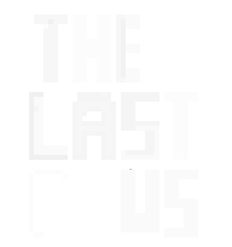
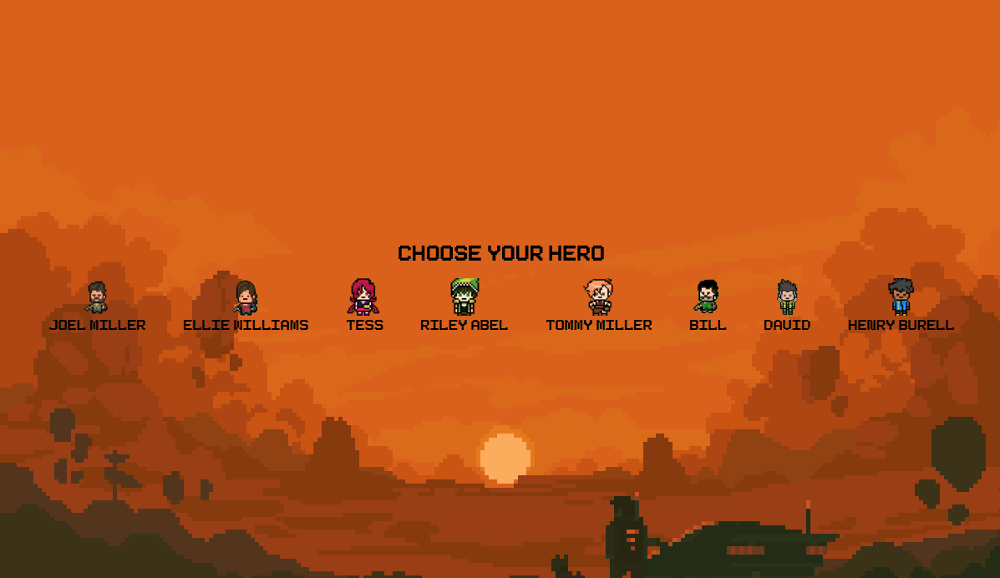
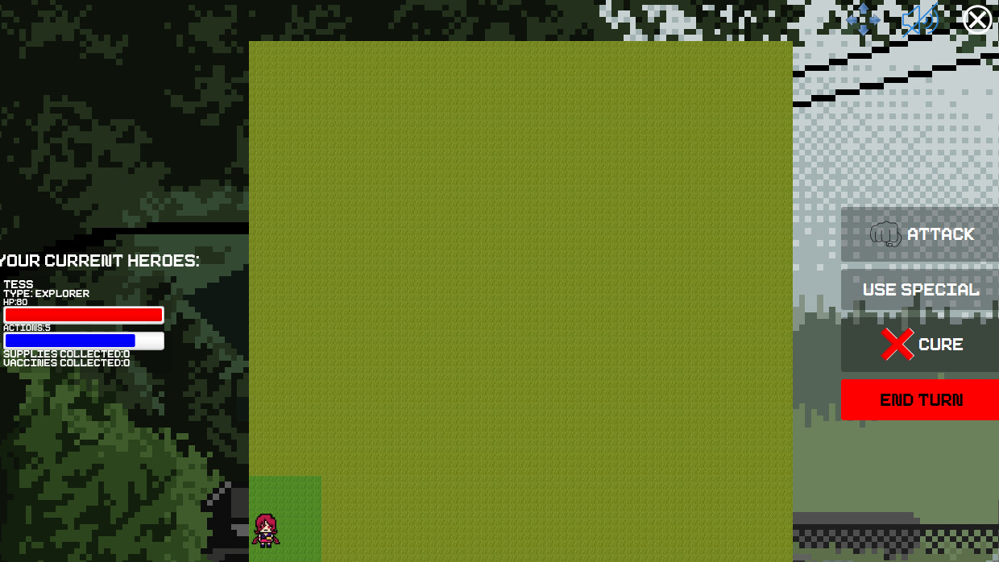

# The-Last-of-Us-Legacy



# Description
The Last of Us: Legacy is a single player survival game set in a zombie apocalyptic world. The game is conducted in a turn based manner, in which each player character receives a specific number of action points per turn, which they can use to move, attack or cure zombies, or use special actions.

The player starts the game controlling only one hero, but can gain additional heroes by curing zombies. The objective of the game for the player is to survive as long as it takes in order to cure a sufficient number of zombies enough to build a community to survive the apocalypse.

# Characters
Characters in the game are split into Heroes or Zombies

# Heroes
Heroes are the types of characters that the player can control. There are several types of heroes available in the game, each one provides different assets for the player in order to win the game.
Any character; Zombie or Hero, has an initial amount of health that decreases whenever they are attacked. If the character’s health ever reaches 0 they are killed and removed from the game.
Considering that the aim of the game is to build a large enough community to survive the apocalypse thus the player must try to maintain and protect their heroes at all costs, as well as try to expand their available pool of heroes.

Each hero type has a unique action they can add to the player’s team:

• Explorer: Allows the player to be able to see the entirety of the map for 1 turn whenever a supply is used.

• Medic: Can heal and restore health to other heroes or themselves, each process of healing uses 1 supply.

• Fighter: Can attack as many times in a turn without costing action points, for 1 turn whenever a supply is used.

Possible actions that can be done by a character:

• Move

• Attack a zombie

• Cure a zombie

• Use their class dependant unique action

# Zombies
Zombies are the types of characters that threaten the player during the game. Zombies cannot be controlled, however they can be cured or attacked. Each time a zombie is killed another zombie will spawn somewhere on the map. In addition to extra zombies spawning every time the player ends a turn.
Whenever a zombie is cured an extra hero will take its place and be available for the player to
use in future turns.

# Collectibles
Collectibles are scattered objects across the map that can help the player survive and advance in the game. Each collectible is only usable once, and after that is discarded from the hero’s inventory and cannot be reused.

• Vaccines: Vaccines are an integral and important part of the game. As the player can only win the game once all vaccines have been collected and used. Vaccines are also the only means through which players can cure zombies and recruit new heroes.

• Supplies: Supplies are the other type of collectible available in the game. Supplies enable the carrying hero to use their special action.

# Gameplay Flow
The player starts off in a 15x15 grid map with just one hero and 10 zombies. The player can only see the directly adjacent cells next to their pool of heroes. The player then keeps taking his turn trying to collect vaccines, and cure or kill zombies. The game ends when the player has collected and used all vaccines or when all heroes have been overwhelmed and defeated by the zombies. The player only wins if he has successfully collected and used all vaccines and has 5 or more heroes alive.

# Preview
You can check out a video of the game here

#### Choosing Hero:


=======================
#### Game View:


=======================
# How to Run

#### Users Installation
  1. Install JDK from here and JavaFX from here (make sure to remember where you installed JavaFX)
  2. Download the game's ZIP file OR fork and clone into your local respository
  3. Open the command line terminal (or Windows PowerShell), navigate to the local repository and run:
   
```sh
 java --module-path "{...}" --add-modules javafx.controls,javafx.fxml,javafx.media -jar Ultimate-War.jar
```
  
replace {...} with the path to the "lib" folder inside JavaFX that you installed in step 1.

##### Developers Installation
  1. Install JDK from here, Eclipse from here, and JavaFX from here (make sure to remember where you installed it)
  2. Download the game's ZIP file OR fork and clone into your local respository
  3. Open Eclipse, Navigate to window -> preferences -> search for "user libraries" -> new -> type "JavaFX" -> Add External JARs... -> select the JARs you installed from step 2.
  4. Open the project using Eclipse, right click on it and choose Build Path -> Configure Build Path -> Add Library -> User Library -> JavaFX
  5. Right Click on the project, Run as -> Run configurations -> Select "View" from left bar -> Arguments and paste the following under VM arguments:

```sh
 "--module-path {...} --add-modules javafx.controls,javafx.fxml,javafx.media"
```

replace {...} with the path to the "lib" folder inside JavaFX that you installed in step 1 and run.

#### Where in Git?
To Start the Game, run the main method in StartScreen.

Got to GUI -> Application -> StartScreen.java

# Contributors

- [Ahmed Mostafa](https://github.com/a7medm0stafa)

# Message
As the creator of the game, we have used JavaFX to design the user interface. We have also incorporated object-oriented programming principles to create a robust and scalable game architecture. This includes classes for the game's characters, items, and environment, allowing for easy expansion and modification of the game.

One of the strengths of object-oriented programming is its ability to create reusable code. By creating classes, you can easily add new characters, items, and environments to the game without having to rewrite the code for each one. This makes it easy to expand the game's content and add new features in the future.

JavaFX provides a rich set of tools for building interactive user interfaces. With JavaFX, you can create complex layouts that include images, text, and other graphical elements, as well as animations and transitions that make the game feel more immersive.

Building a game like The Last of Us requires careful testing and debugging to ensure that the game runs smoothly and without any glitches. This is an important part of the development process and demonstrates your attention to detail and dedication to creating a high-quality game.

Overall, The Last of Us is an impressive project that showcases your skills as a programmer. It combines the power of JavaFX with object-oriented programming principles to create a compelling and immersive game experience.

We hope you enjoy playing The Last of Us as much as we enjoyed creating it!

